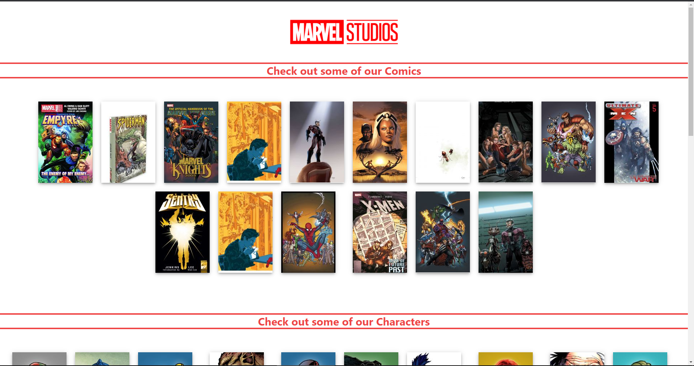

## Getting Started

First, install the dependencies after cloning the repository.

```bash
npm install
# or
yarn dev
```

Open [http://localhost:3000](http://localhost:3000) after running the command npm run dev.

## Used the Marvel API and displayed information about Comics, Characters and Stories

## Check out my explanation video

[Demonstration Video](https://www.loom.com/share/3ea682458ce74debbb98af7899c44e3c)


